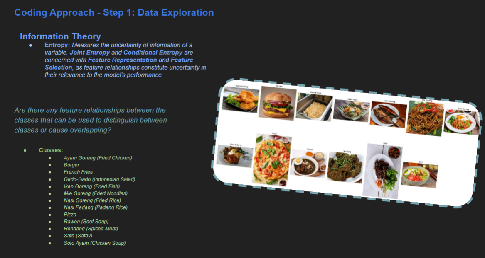
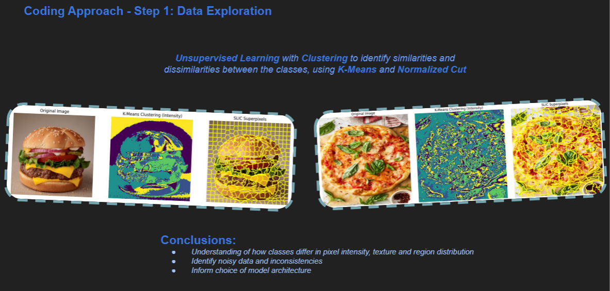
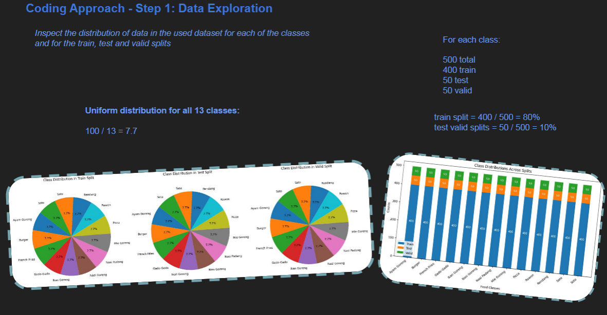
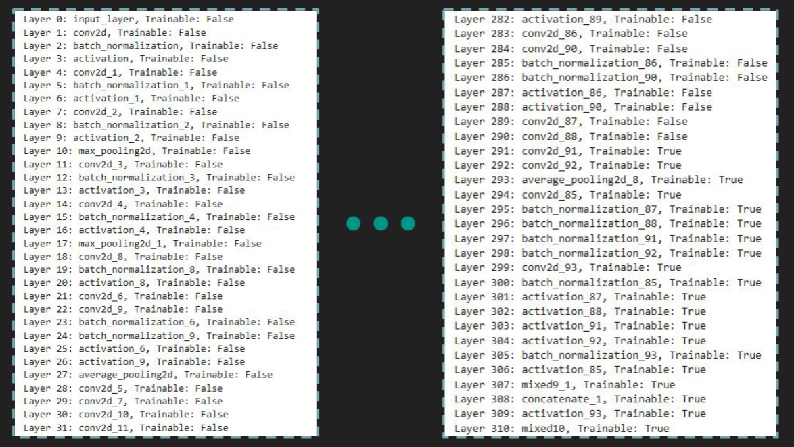
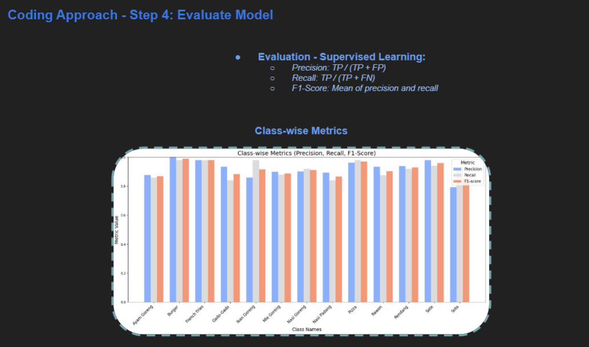
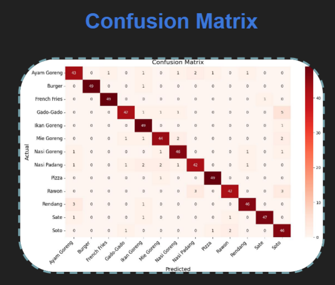
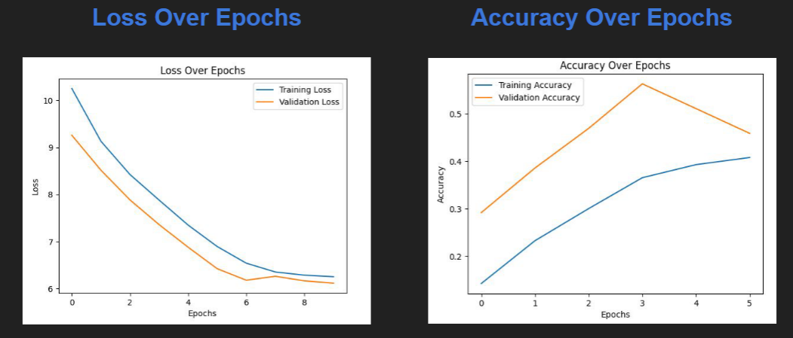
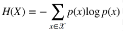

# 🧠 Neural Network Image Classification

> Implementing InceptionV3 CNN for robust food image classification

## 📑 Table of Contents
- [🧠 Neural Network Image Classification](#-neural-network-image-classification)
  - [📑 Table of Contents](#-table-of-contents)
  - [🎯 Overview](#-overview)
  - [🤖 Model Selection](#-model-selection)
  - [💻 Implementation Approach](#-implementation-approach)
    - [Exploratory Data Analysis](#exploratory-data-analysis)
    - [Model Architecture](#model-architecture)
    - [Optimization Techniques](#optimization-techniques)
  - [📊 Performance Results](#-performance-results)
  - [📚 Information Theory Concepts](#-information-theory-concepts)
    - [Entropy and Information Measures](#entropy-and-information-measures)
    - [Advanced Topics](#advanced-topics)
  - [🔗 Related Projects](#-related-projects)
    - [AI \& Machine Learning](#ai--machine-learning)
    - [Predictive Modeling](#predictive-modeling)

## 🎯 Overview

During my exchange studies in Italy (2024-2025), I took the "Foundations of Machine Learning" course focusing on information theory and neural networks. The final project required implementing a deep neural network to classify images from the [Indonesian Food Dataset](https://www.kaggle.com/datasets/rizkyyk/dataset-food-classification).

This dataset contains **6,500 images** across 13 food categories:
- Ayam Goreng (Fried Chicken)
- Burger
- French Fries
- Gado-Gado
- Ikan Goreng (Fried Fish)
- Mie Goreng (Fried Noodles)
- Nasi Goreng (Fried Rice)
- Nasi Padang
- Pizza
- Rawon
- Rendang
- Sate (Satay)
- Soto Ayam

I leveraged Kaggle's cloud platform to avoid local computation constraints: [Machine Learning Notebook](https://www.kaggle.com/code/joel0303/machine-learning-notebook).

## 🤖 Model Selection

After researching various neural network architectures, I narrowed my options based on project constraints:

| Model | Advantages | Disadvantages | Decision |
|-------|------------|--------------|----------|
| **Perceptron** | Simple, fast | Limited to linear separation | Rejected |
| **VGGNet** | Accurate predictions | Time-consuming for debugging | Rejected |
| **Inception** | Simple, fewer resources | Limited flexibility | Considered |
| **InceptionV3** | High performance, versatile | More complex | **Selected** |
| **EfficientNet** | State-of-the-art performance | High complexity | Rejected |

Given the one-week project timeline and accuracy requirements, **InceptionV3** proved to be the optimal choice, providing a good balance between computational efficiency and classification performance.

## 💻 Implementation Approach

### Exploratory Data Analysis

Before building the model, I performed thorough exploratory analysis:

1. **Dataset Inspection**: Examined structure and image properties
   
   

2. **Pixel Clustering**: Analyzed color distributions and similarities
   
   

3. **Class Distribution**: Verified dataset balance across categories
   
   

### Model Architecture

The implemented solution leverages the InceptionV3 architecture with custom modifications:

### Optimization Techniques

To enhance model performance and generalization, I implemented several techniques:

- **Transfer Learning**: Utilized pre-trained weights from InceptionV3
- **Softmax Activation**: Applied for probabilistic multiclass classification
- **Cross-Entropy Loss**: Optimized for classification tasks
- **Adam Optimizer**: Enabled efficient gradient updates
- **L2 Regularization**: Mitigated overfitting by penalizing large weights
- **Fine-Tuning**: Selectively optimized specific network layers
- **Dropout Layers**: Randomly deactivated neurons during training
- **Data Augmentation**: Generated diverse training samples through transformations
- **Early Stopping**: Monitored validation metrics to prevent overfitting

## 📊 Performance Results

The model achieved excellent classification results across the food categories:

**Class-wise Performance Metrics**:

**Confusion Matrix**:

**Training Progress**:

## 📚 Information Theory Concepts

The project applied several key information theory and machine learning principles:

### Entropy and Information Measures

- **Entropy (H(X))**: Quantifies uncertainty in a system
  
  

- **Joint Entropy (H(X,Y))**: Measures uncertainty of two variables together
- **Conditional Entropy (H(Y|X))**: Quantifies remaining uncertainty in Y given X
- **Mutual Information (I(X;Y))**: Measures shared information between variables

### Advanced Topics

- **Data Compression**: Huffman coding and channel coding theorem
- **Gradient Descent**: Optimization through forward and backward passes
- **Optimal Brain Surgeon**: Weight pruning for network efficiency
- **Statistical Learning Theory**: VC dimension and generalization guarantees
- **Support Vector Machines**: Margin optimization for classification
- **Clustering Techniques**: K-means and dominant-set approaches

## 🔗 Related Projects AI Projects

- [AI Classifiers](https://github.com/mrjex/Artificial-Intelligence-Classifiers)
- [AWS Generative AI Endpoint](https://github.com/mrjex/AWS-Generative-AI-Endpoint)
- [Project Branno](https://github.com/mrjex/Project-Branno)
- [AI Clusters](https://github.com/mrjex/Artificial-Intelligence-Clusters)
- [Machine Learning Clustering System](https://github.com/mrjex/Machine-Learning-Clustering-System)

---

*A Convolutional Neural Network developed to achieve high accuracy for image classification*
