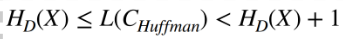
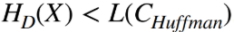
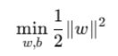

# Machine Learning Project

I attended the course `Foundations of Machine Learning` in 2024-2025 during my exchange studies in Italy. This course was mainly about information theory and neural networks, involving concepts such as classification, deep learning, entropy, model generalization and mutual information. At the end of the course, the students were assigned an individual task related to the project. In my case, I had to implement a deep neural network to classify images on the given dataset: https://www.kaggle.com/datasets/rizkyyk/dataset-food-classification. After conducting research in the field, I arrived at the conclusion that the most suitable model in my case, where accuracy was a priority, that Convolutional Neural Networks (CNNs) was a suitable option. However, initially I was looking at Perceptrons but discovered that their limitation of linear separabaility and simplistic neural architecture wouldn't achieve a satisfying result, although they are applicable to the problem. The next question that naturally emerges was which CNN model to adopt. I looked at AlexNet, VGGnet, Inception, InceptionV3 and EfficientNet, and after breaking it down to only three models, I had the following rationale:

- **VGGNet:** *Time consuming when debugging, yet yields accurate predictions*

- **Inception vs InceptionV3:** *Inception is more simple and require less computational resoures, and InceptionV3 has a capability for high-performance tasks*

I discared VGGnet due to the tight deadline of the project, only having one week to code the project. And as for the Inception models, the newer model, according to online documentation, provided a better flexibility that made it suitable for a wider range of situations and environments. In this project, I created a Kaggle Notebook on the cloud (https://www.kaggle.com/code/joel0303/machine-learning-notebook) to avoid having to download the large dataset and perform heavy computational operations on my local computer, as well as having to download kernel dependencies to support all involved Python libraries. For the sake of providing easy access to my work in this Git repository, I put the notebook in this directory as `CNN_Project.ipynb`.

## Table of Contents

- [Machine Learning Project](#machine-learning-project)
  - [Table of Contents](#table-of-contents)
  - [My Other Experiences Related To AI \& ML](#my-other-experiences-related-to-ai--ml)
  - [Coding Approach](#coding-approach)
    - [Exploratory Data Analysis](#exploratory-data-analysis)
    - [Additional Measures Taken to improve model generalization](#additional-measures-taken-to-improve-model-generalization)
  - [Model Performance](#model-performance)
  - [Information Theory](#information-theory)
    - [Data Compression](#data-compression)
      - [Huffman Coding](#huffman-coding)
      - [The Channel Coding Theorem](#the-channel-coding-theorem)
    - [Gradient Descent](#gradient-descent)
    - [Optimal Brain Surgeon](#optimal-brain-surgeon)
    - [Statistical Learning Theory](#statistical-learning-theory)
      - [Shattering](#shattering)
      - [VC Dimension](#vc-dimension)
      - [Confidence Interval](#confidence-interval)
      - [Support Vector Machines](#support-vector-machines)
      - [K-Means](#k-means)
      - [Relaxation](#relaxation)
      - [Dominant-set Clustering](#dominant-set-clustering)

## My Other Experiences Related To AI & ML

- [Foundations of Artificial Intelligence](https://gitlab.com/jex-projects/mrjex/-/tree/main/projects/1.%20courses/year-3/1.%20Exchange%20Studies%20Venice/1.%20Foundations%20of%20Artificial%20Intelligence?ref_type=heads)

- [Real Estate Price Prediction](https://gitlab.com/jex-projects/mrjex/-/tree/main/projects/2.%20spare-time/4.%20Real-Estate-Price-Prediction?ref_type=heads): *Predict prices with Machine Learning model*

- [Sagemaker AWS Prediction](https://gitlab.com/jex-projects/mrjex/-/tree/main/projects/2.%20spare-time/8.%20Sagemaker%20AWS%20Prediction?ref_type=heads): *Predict classification of data based on properties*

- [Data Science & Business Intelligence](https://gitlab.com/jex-projects/mrjex/-/tree/main/projects/1.%20courses/year-3/1.%20Exchange%20Studies%20Venice/5.%20Data%20Science%20&%20Business%20Intelligence?ref_type=heads)

- [Project Branno](https://gitlab.com/jex-projects/mrjex/-/tree/main/projects/2.%20spare-time/1.%20Project%20Branno?ref_type=heads): *Yolov8 object detection, text detection, face recognition*

- [Relational Analysis And Visualization](https://gitlab.com/jex-projects/mrjex/-/tree/main/projects/2.%20spare-time/2.%20Relational-Analysis-And-Visualization?ref_type=heads): *Machine Learning Prediciton Model with linear Regression*

- [Product Demand Prediction](https://gitlab.com/jex-projects/mrjex/-/tree/main/projects/2.%20spare-time/3.%20Product-Demand-Prediction?ref_type=heads): *Machine Learning model for prediction*

- [AWS Bedrock Generative AI](https://gitlab.com/jex-projects/mrjex/-/tree/main/projects/2.%20spare-time/11.%20AWS%20Bedrock%20Generative%20AI?ref_type=heads): *Generate a cohesive textual description of a prompted topic*

## Coding Approach

Now, once the selection of neural network and approach was established, my new task was to inspect the dataset further and figure out how to best implement the neural network. A given constraint for the assignment was that the model had to divide the input dataset into three different sections to emulate the behavior of supervised classification algorithms, using groud truth labels to evaluate the accuracy. Fortunately, I had two prior experiences with classifiers ([Data Science & Business Intelligence](https://gitlab.com/jex-projects/mrjex/-/tree/main/projects/1.%20courses/year-3/1.%20Exchange%20Studies%20Venice/5.%20Data%20Science%20&%20Business%20Intelligence?ref_type=heads), [Foundations of Artificial Intelligence](https://gitlab.com/jex-projects/mrjex/-/tree/main/projects/1.%20courses/year-3/1.%20Exchange%20Studies%20Venice/1.%20Foundations%20of%20Artificial%20Intelligence?ref_type=heads)).

- **Indonesian Food Dataset:** *This image dataset consists of 13 categories, including Ayam Goreng (Fried Chicken), Burger, French Fries, Gado-Gado, Ikan Goreng (Fried Fish), Mie Goreng (Fried Noodles), Nasi Goreng (Fried Rice), Nasi Padang, Pizza, Rawon, Rendang, Sate (Satay), and Soto Ayam. It contains a total of **6,500 images**, with 500 images in each category*

### Exploratory Data Analysis

1. Inspect the contained `.jpg` files in the dataset:

2. Cluster pixels by similarity:

3. Check class distributions:

### Additional Measures Taken to improve model generalization
This project focuses on image classification using a Kaggle dataset: Food Classification Dataset. The primary goal was to achieve the highest possible classification accuracy by leveraging a neural network. To accomplish this, I implemented the following key components:

- **Convolutional Neural Network (InceptionV3):** Utilized a pre-trained model for feature extraction and classification.
- **Softmax Activation Function:** Applied for probabilistic outputs in the classification layer.
- **Cross-Entropy Loss Function:** Used as the objective function to minimize during training.
- **Adam Optimizer:** Employed to efficiently update model weights during optimization.
- **L2 Regularization:** Added to reduce overfitting by penalizing large weights.
- **Fine-Tuning:** Enabled further optimization of specific layers for improved performance.
- **Dropout:** Introduced to prevent overfitting by randomly deactivating neurons during training.
- **Data Augmentation:** Enhanced model generalization by generating diverse training samples.
- **Early Stopping:** Monitored validation performance to halt training when improvements plateaued

## Model Performance

**Extra Terminology**
- The learning or training phase is about determining a configuration of weights so that the network's output be as close as possible to the desired output

- Classifiers are sensitive to the features used
- Removal of irrelevant and redundant information
- Improve generalization by reducing overfitting

## Information Theory

- **Entropy:** A measure of the uncertainty in a system or variable: **H(X)**

- H(X) >= 0: Non-negativity since probabilities are between 0 and 1
H(X) <= log(n), where n is the number of possible outcomes. This is the maximal entropy, which is achieved when uniform distribution is satisfied, where all n outcomes are equally likely

- **Joint Entropy:** The uncertainty of two variables when considered together: **0 =< H(X,Y) <= H(X) + H(Y)**

- **Conditional Entropy:** A measure of the amount of uncertainty remaining in one random variable Y, given that the value of another random variable X is known. It quantifies the dependency between two variables: **0 =< H(Y|X) <= H(Y)**

- **Mutal Information:**

- Quantifies the amount of shared information, or, the amount of information that one variable contains about another

- I(X;Y) = H(X) + H(Y) - H(X, Y)

- I(X;Y) = H(X) - H(X|Y)

- **Kullback Leibler (KL) Divergence**

- Measures how one probability distribution differs from another. P(X) is the true probability distribution and Q(X) is an approximate or assumed probability distribution. KL Divergence is often called relative entropy because it quantifies the additional number of bits needed to encode data from P using Q instead

### Data Compression

The goal of source coding is to represent data as compactly as possible, reducing redundancy while preserving essential information. A source code C for a variable X and probability distribution P(X) is the mapping: C → D^x, where D^x is a set of strings from an alphabet of length D. C(x) is the associated codeword. The classes of codes are:

- **Nonsingular:** Each symbol maps to a unique codeword

- **Uniquely decodable:** Unique decoding of entire sequences

- **Instantaneous:** No codeword is a prefix of another codeword. This means that decoding can be done immediately without looking ahead

#### Huffman Coding

Huffman Coding is a data compression algorithm. Its goal is to minimize the total number of bits required to encode the input, using instantaneous codes. It is based on the optimality of producing the smallest code length by assigning shorter codewords to more frequent symbols and vice versa

- **L(C):** The average codeword length

- **HD(X):** Entropy (minimum possible length). This is the best and shortest length if you were perfect at compression. It’s like the shortest possible way to say something without losing meaning

- **L(C) >= HD(X):** You can’t compress information (on average) to be smaller than its fundamental entropy limit

- **D-adic:** A D-adic probability distribution is a probability distribution where all probabilities are expressed as fractions with denominators that are powers of D. It stems from the idea of numbers being structured in base D. Many coding schemes or compression algorithms work best when the probabilities are D-adic, because they are aligned with the same base

For D-adic probability distributions:

If the distribution isn’t D-adic:

#### The Channel Coding Theorem

For a communication channel with a given capacity C:
- If the transmission rate is less than or equal to the channel capacity (R <= C), then it’s possible to receive transmitted information with a low error probability

- If R > C, no such reliable communication is possible, and the error probability rises

- Mutual Information I(X;Y) measures the actual amount of information successfully transmitted through the channel
Transmission Rate R: The number of bits sent per channel use

- Channel Capacity C: The maximum mutual information achievable for the channel

### Gradient Descent

An optimization algorithm to minimize the loss function of a model by iteratively adjusting its parameters (weights and biases). We use the two following concepts:
Forward pass: The network is propagated layer after layer in forward direction
Backward pass: The “error” made by the network is propagated backward, and weights and biases are updated accordingly

### Optimal Brain Surgeon

Is a pruning technique used in neural networks to reduce the size of a trained network while preserving its performance. It removes redundant weights, yet focuses on maintaining accuracy
Process:
1. Identify weights that, when removed, have the smallest impact on the loss function
2. Compute the weight update: After removing a weight, the remaining weights are re-optimized to compensate for the removal

OBS removes weights based on second order derivatives (Hessian matrix)

### Statistical Learning Theory

*Bridges the gap between statistics, machine learning and optimization, and it’s fundamental to supervised learning*

**Bayes’ Theorem:**

- Other related experiences with Bayes: [Foundations of Artificial Intelligence, Assignment 2](https://gitlab.com/jex-projects/mrjex/-/tree/main/projects/1.%20courses/year-3/1.%20Exchange%20Studies%20Venice/1.%20Foundations%20of%20Artificial%20Intelligence/assignments/a2?ref_type=heads), [Data Science & Business Intelligence](https://gitlab.com/jex-projects/mrjex/-/tree/main/projects/1.%20courses/year-3/1.%20Exchange%20Studies%20Venice/5.%20Data%20Science%20&%20Business%20Intelligence?ref_type=heads)

- **P(h):** Prior probability of hypothesis h
- **P(h|e):** Posterior probability of hypothesis h in the light of evidence e
- **P(e|h):** Likelihood of evidence e on hypothesis h

#### Shattering

Refers to the ability of a hypothesis class to separate or classify a set of points in all possible ways, given their possible labels:

- **Hypothesis Class:** The set of models or classifiers you’re considering. These models are capable of assigning labels to the data points

- **Labelings:** For a set of points, there are different ways to assign labels to them. If you have n points, there are 2^n possible ways to assign binary labels to those points

- **Shattering:** If the hypothesis class can assign labels to all 2^n labelings, then the hypothesis class is said to shatter those n points. This means that the hypothesis class has the capacity to distinguish between all different labelings

#### VC Dimension

It measures the capacity or expressive power of a hypothesis class. It’s an important tool for understanding how well a model can learn from data, how complex it is, and how likely it is to overfit. A VC dimension of a hypothesis class is defined as the size of the largest set of points that can be **shattered** by that hypothesis class. Since the VC Dimension helps to understand the complexity of a model, it provides insights into a model's generalization ability:

- A high VC Dimension indicates a more complex hypothesis class. Such models can fit intricate patterns in the data, but they are more prone to overfitting
- 
- A low VC Dimension suggests a simpler model that has higher bias but lower variance

#### Confidence Interval

A measure of uncertainty in the model’s predictions. The confidence interval depends on the ratio **h / n**, where *h* refers to the VC dimension and *n* to the number of training samples. The ratio *h / n* represents the relationship between the model complexity (VC Dimension) and the amount of training data:

- If the model is too complex (large h), the confidence interval gap is wide and fluctuating, making the predictions less certain

- If the model is simpler (smaller h) or for more training samples (larger n), the confidence interval becomes more compact with higher confidence

#### Support Vector Machines

- Related Experiences: [Foundations of Artificial Intelligence, Assignment 2](https://gitlab.com/jex-projects/mrjex/-/tree/main/projects/1.%20courses/year-3/1.%20Exchange%20Studies%20Venice/1.%20Foundations%20of%20Artificial%20Intelligence/assignments/a2?ref_type=heads), [Data Science & Business Intelligence](https://gitlab.com/jex-projects/mrjex/-/tree/main/projects/1.%20courses/year-3/1.%20Exchange%20Studies%20Venice/5.%20Data%20Science%20&%20Business%20Intelligence?ref_type=heads)

- Optimization problem of linear SVMs

- A hyperplane is defined by: **wx + b = 0**, where w is the weight, x the data point and b the bias term

**Primal optimization problem for hard margin SVM:** Minimize the objective function while ensuring that classification constraints are satisfied:

Since function above minimizes the weights, the maximal margin is ensured. The margin and weight vector w are inversely proportional, and minimizing `||w||` results in reducing the model complexity and the VC dimension. Models with smaller VC dimensions are less likely to overfit. In addition, decreasing `||w||` increases the margin. Thus, the greater the margin, the less VC dimension, in general

#### K-Means

**Related Experiences:**
- K-Means: [Data Science & Business Intelligence](https://gitlab.com/jex-projects/mrjex/-/tree/main/projects/1.%20courses/year-3/1.%20Exchange%20Studies%20Venice/5.%20Data%20Science%20&%20Business%20Intelligence?ref_type=heads)
- Clustering: [Foundations of Artificial Intelligence, Assignment 3](https://gitlab.com/jex-projects/mrjex/-/tree/main/projects/1.%20courses/year-3/1.%20Exchange%20Studies%20Venice/1.%20Foundations%20of%20Artificial%20Intelligence/assignments/a3?ref_type=heads)

**K-Means:** Pick K random points as cluster centers. Assign data points closest to centroids and change the position of the centroids to the average of its assigned points. It stops when the assignment of points doesn’t change, or when a predetermined number of iterations has transpired

- Advantages: Simple and efficient

- Disadvantages: Converges to local optimum if initial assignment of centroids is inappropriate. It’s also sensitive to outliers and only detects spherical clusters

#### Relaxation

Refers to a method or process of simplifying or approximating a problem to make it easier to solve, often by loosening some constraints or conditions of the original problem. It’s a technique used to find solutions to complex problems, where exact solutions may be computationally expensive to compute.

- Relaxation involves transforming hard constraints into soft constraints by approximating them in a way that makes the problem more solvable

- For example, in SVMs, there’s a trade-off between maximizing the margin and minimizing classification errors. The hard margin constraint (which requires no misclassifications) is relaxed to a soft margin constraint, allowing some misclassification but still allowing to maximize the margin

- In addition, Normalized Cut is complex and hard to solve, making it beneficial to apply relaxation to approximate it. We first turn it from discrete to continuous cluster assignments. Instead of assigning each vertex to S or T, we represent it as a real-valued vector. The continuous values indicate the degree of membership of each of the clusters. We use eigenvalues, adjacency- and degree matrix: L = D - A

#### Dominant-set Clustering

A method used for clustering data. It is based on the idea that clusters can be identified by finding “dominant sets” within a graph. A dominant set is a subset of nodes that are densely connected internally, and have weak or no connections to other nodes outside the set. This approach is effective when clusters aren’t spherical, as it captures more complex structures
Average Weighted Degree: Reflects the overall strength of connections in the graph
Symmetric Affinity: Refers to a type of similarity between data points where it is the same in both directions: W(x, y) = W(y, x). This concept is important since Dominant-set clustering relies on a similarity matrix to identify clusters
Binary Symmetric Affinities: A value of 1 indicates that two data points are similar or belong to the same cluster. A value of 0 indicates that the data points are unrelated
Clique: Is a set of nodes where every node is adjacent to every other node in the subset. There are edges between every pair of nodes
